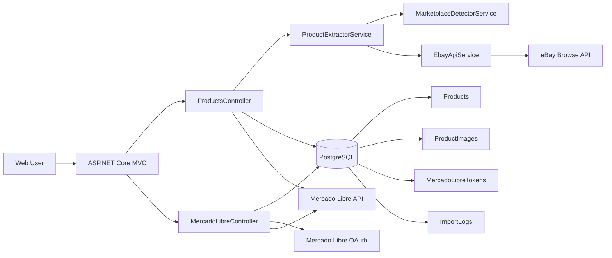
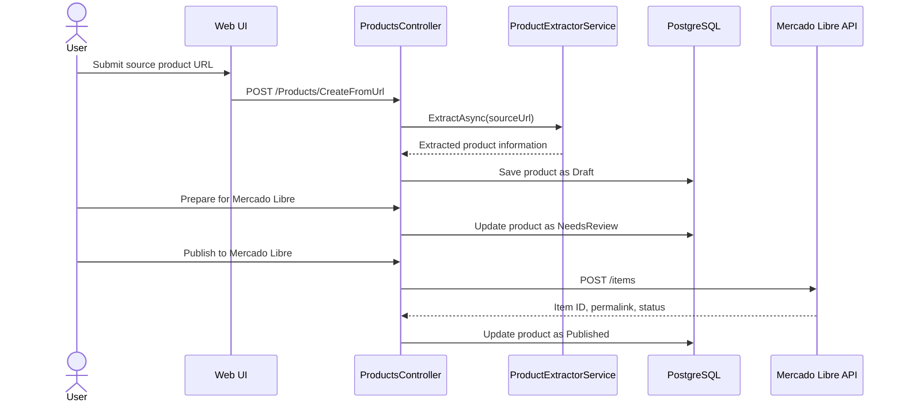

# MarketplaceSync

MarketplaceSync is an ASP.NET Core MVC application designed to import, review, and publish products from external marketplaces into Mercado Libre.

The project currently supports product creation from marketplace URLs, basic marketplace detection, eBay product extraction using the eBay Browse API, product persistence in PostgreSQL, Mercado Libre OAuth connection, category helper endpoints, and publication to Mercado Libre.

## Main Features

- Create products from source marketplace URLs.
- Detect source marketplace: Amazon, eBay, Mercado Libre, or unknown.
- Extract product information from eBay using eBay Browse API.
- Store products in PostgreSQL using Entity Framework Core.
- Review and edit product information before publishing.
- Prepare price, stock, currency, condition, and listing type for Mercado Libre.
- Connect Mercado Libre account using OAuth.
- Predict Mercado Libre categories based on product title.
- Load required attributes for Mercado Libre categories.
- Publish products to Mercado Libre.

## Tech Stack

- ASP.NET Core MVC
- C#
- Entity Framework Core
- PostgreSQL
- Razor Views
- IHttpClientFactory
- eBay Browse API
- Mercado Libre API

## High-Level Architecture



## Product Flow



## Main Documentation

- [Architecture](docs/architecture.md)
- [Application Flows](docs/flows.md)
- [Database Model](docs/database.md)
- [Mercado Libre Integration](docs/mercadolibre.md)
- [eBay Integration](docs/ebay.md)
- [Recommended Improvements](docs/recommendations.md)

## Configuration Example

```json
{
  "ConnectionStrings": {
    "DefaultConnection": "Host=localhost;Database=marketplace_sync;Username=postgres;Password=your_password"
  },
  "Ebay": {
    "ClientId": "your_ebay_client_id",
    "ClientSecret": "your_ebay_client_secret",
    "MarketplaceId": "EBAY_US"
  },
  "MercadoLibre": {
    "ClientId": "your_mercadolibre_client_id",
    "ClientSecret": "your_mercadolibre_client_secret",
    "RedirectUri": "https://your-domain.com/MercadoLibre/Callback",
    "AuthUrl": "https://auth.mercadolibre.com.mx/authorization",
    "TokenUrl": "https://api.mercadolibre.com/oauth/token"
  }
}
```

> Do not commit real secrets, tokens, passwords, or API credentials to the repository.

## Recommended Next Steps

- Add automatic Mercado Libre token refresh.
- Move Mercado Libre publishing logic into dedicated services.
- Add internal authentication and authorization.
- Add background jobs for price and stock synchronization.
- Improve Amazon extraction through an official API or approved data provider.
- Add deployment documentation for Render or the selected hosting platform.
