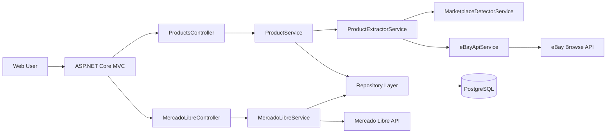
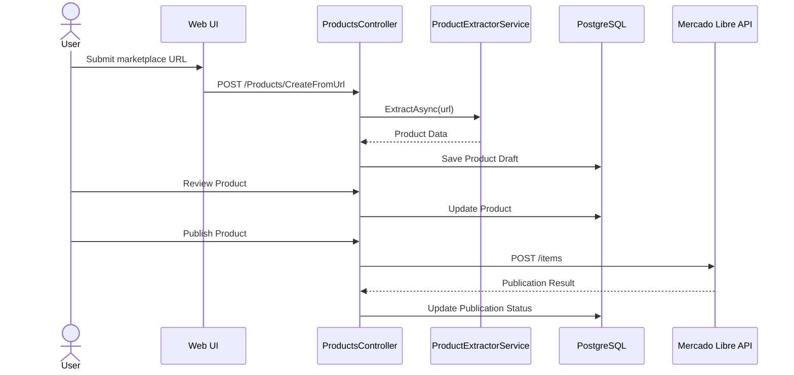

# MarketplaceSync

MarketplaceSync is a scalable ASP.NET Core MVC platform designed to import, manage, review, synchronize, and publish products from external marketplaces into Mercado Libre.

The application centralizes product extraction, product normalization, marketplace synchronization, and Mercado Libre publication workflows using a modular service-oriented architecture.

---

# Features

## Marketplace Import

- Import products from external marketplace URLs
- Marketplace detection support
- eBay product extraction using eBay Browse API
- Product normalization pipeline
- Product image extraction

---

## Product Management

- Product CRUD operations
- Product review workflow
- Draft and publication states
- Product editing before publication
- Inventory preparation
- Price preparation
- Listing type management

---

## Mercado Libre Integration

- OAuth authentication flow
- Mercado Libre publication support
- Category prediction
- Attribute loading
- Product publishing
- Publication status tracking

---

## Database Persistence

- PostgreSQL persistence using Entity Framework Core
- Product storage
- Product image storage
- Import logs
- OAuth token persistence

---

# Technology Stack

| Technology | Purpose |
|---|---|
| ASP.NET Core MVC | Web Framework |
| C# | Backend Language |
| Entity Framework Core | ORM |
| PostgreSQL | Database |
| Razor Views | Frontend Rendering |
| Docker | Containerization |
| GitHub | Source Control |
| Mercado Libre API | Marketplace Publishing |
| eBay Browse API | Product Extraction |
| IHttpClientFactory | API Communication |

---

# High-Level Architecture


```mermaid
flowchart LR
    User[Web User] --> MVC[ASP.NET Core MVC]

    MVC --> ProductsController[ProductsController]
    MVC --> MercadoLibreController[MercadoLibreController]

    ProductsController --> ProductService[ProductService]
    MercadoLibreController --> MercadoLibreService[MercadoLibreService]

    ProductService --> Extractor[ProductExtractorService]
    Extractor --> Detector[MarketplaceDetectorService]
    Extractor --> EbayService[eBayApiService]

    ProductService --> Repository[Repository Layer]
    MercadoLibreService --> Repository

    Repository --> DB[(PostgreSQL)]

    EbayService --> EbayAPI[eBay Browse API]
    MercadoLibreService --> MLAPI[Mercado Libre API]
```

---

# Product Synchronization Flow


```mermaid
sequenceDiagram
    actor User as User
    participant UI as Web UI
    participant PC as ProductsController
    participant EX as ProductExtractorService
    participant DB as PostgreSQL
    participant ML as Mercado Libre API

    User->>UI: Submit marketplace URL
    UI->>PC: POST /Products/CreateFromUrl

    PC->>EX: ExtractAsync(url)
    EX-->>PC: Product Data

    PC->>DB: Save Product Draft

    User->>PC: Review Product
    PC->>DB: Update Product

    User->>PC: Publish Product
    PC->>ML: POST /items

    ML-->>PC: Publication Result
    PC->>DB: Update Publication Status
```

---

# Project Structure

```text
MarketplaceSync/
│
├── Controllers/
├── Services/
├── Models/
├── Repositories/
├── DTOs/
├── ViewModels/
├── Interfaces/
├── Middleware/
├── Helpers/
├── Data/
├── docs/
├── wwwroot/
├── Docker/
└── Tests/
```

---

# Current Modules

## Products Module

Responsibilities:

- Create products
- Edit products
- Delete products
- Review products
- Manage product states
- Prepare products for publication

---

## Marketplace Detection Module

Responsibilities:

- Detect source marketplace
- Route extraction flow
- Validate supported marketplaces

Supported:

- eBay
- Amazon (partial)
- Mercado Libre

---

## Mercado Libre Module

Responsibilities:

- OAuth connection
- Token management
- Category prediction
- Attribute retrieval
- Product publishing
- Publication tracking

---

# Database Entities

## Products

Stores:

- Product title
- Description
- Price
- Stock
- Currency
- Status
- Marketplace source

---

## ProductImages

Stores:

- Product image URLs
- Product image relationships

---

## MercadoLibreTokens

Stores:

- Access tokens
- Refresh tokens
- Expiration information

---

## ImportLogs

Stores:

- Import execution logs
- Error tracking
- Synchronization events

---

# Configuration Example

```json
{
  "ConnectionStrings": {
    "DefaultConnection": "Host=localhost;Database=marketplace_sync;Username=postgres;Password=your_password"
  },
  "Ebay": {
    "ClientId": "your_ebay_client_id",
    "ClientSecret": "your_ebay_client_secret",
    "MarketplaceId": "EBAY_US"
  },
  "MercadoLibre": {
    "ClientId": "your_mercadolibre_client_id",
    "ClientSecret": "your_mercadolibre_client_secret",
    "RedirectUri": "https://your-domain.com/MercadoLibre/Callback",
    "AuthUrl": "https://auth.mercadolibre.com.mx/authorization",
    "TokenUrl": "https://api.mercadolibre.com/oauth/token"
  }
}
```

---

# Security Recommendations

Recommended improvements:

- JWT authentication
- Role-based authorization
- Claims authorization
- Global exception middleware
- Request validation
- CSRF protection
- Secure secret storage
- Audit logging

---

# DevOps Recommendations

Recommended additions:

- GitHub Actions CI/CD
- Docker Compose
- Environment-based configuration
- Automated testing pipeline
- Logging and monitoring
- Background synchronization workers

---

# Future Roadmap

## Planned Improvements

- Automatic Mercado Libre token refresh
- Inventory synchronization
- Price synchronization
- Background jobs
- Queue processing
- Retry policies
- Product analytics
- Multi-marketplace support
- Advanced product matching
- Admin dashboard
- User authentication system
- Clean Architecture migration

---

# Documentation

| Document | Description |
|---|---|
| docs/architecture.md | System architecture |
| docs/database.md | Database model |
| docs/flows.md | Application flows |
| docs/mercadolibre.md | Mercado Libre integration |
| docs/ebay.md | eBay integration |
| docs/recommendations.md | Technical recommendations |

---

# Deployment

The project is compatible with:

- Docker
- Render
- Azure App Service
- AWS
- Linux VPS environments

---

# Important Security Notice

Never commit:

- API keys
- OAuth secrets
- Database passwords
- Access tokens
- Environment secrets

Use:

- appsettings.Development.json
- environment variables
- GitHub Secrets
- secure secret providers

---

# Author

Developed by Francisco Javier Rodríguez Guillén.

Focused on scalable marketplace synchronization, automation, and enterprise-ready ASP.NET development.
