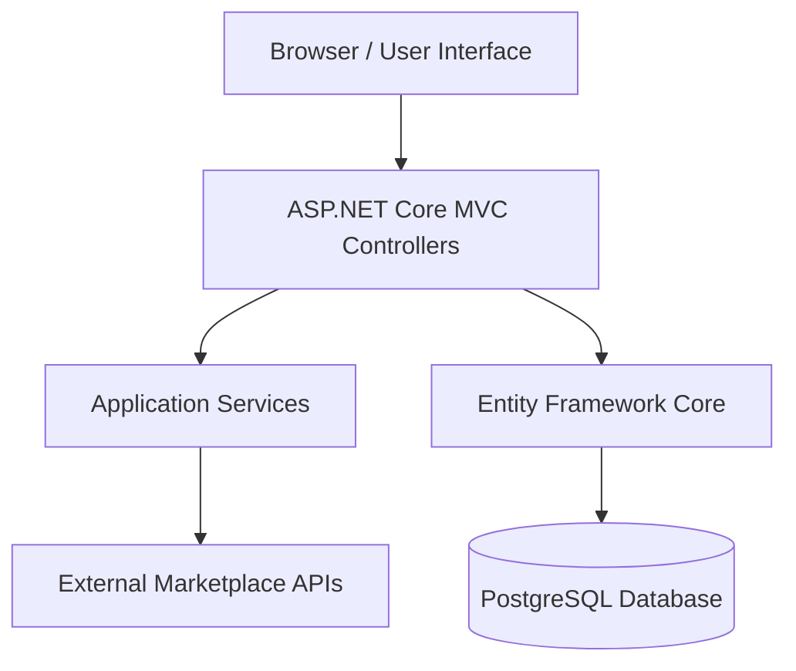
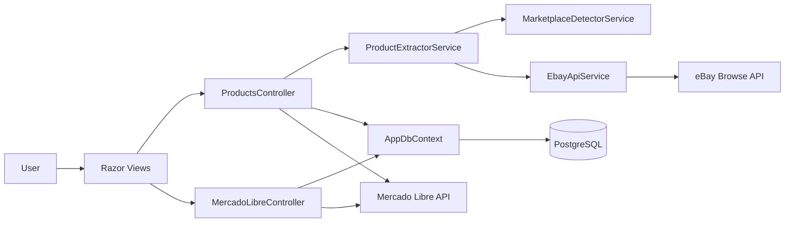

# Architecture

MarketplaceSync is structured as an ASP.NET Core MVC application with a service layer for marketplace detection and product extraction.

## Main Layers

## Main Components

### Controllers

- `ProductsController`
  - Product listing.
  - Product creation from URL.
  - Product editing.
  - Source refresh.
  - Mercado Libre preparation.
  - Mercado Libre publication.

- `MercadoLibreController`
  - Mercado Libre OAuth connection.
  - OAuth callback handling.
  - Token persistence.
  - User profile test endpoint.
  - Category prediction endpoint.
  - Category attributes endpoint.
  - Notifications endpoint placeholder.

### Services

- `MarketplaceDetectorService`
  - Detects whether a URL belongs to Amazon, eBay, Mercado Libre, or an unknown source.
  - Extracts source product IDs such as Amazon ASIN, eBay Item ID, and Mercado Libre MLM ID.

- `ProductExtractorService`
  - Main product extraction orchestrator.
  - Uses `MarketplaceDetectorService` to classify URLs.
  - Uses `EbayApiService` for eBay extraction.
  - Returns placeholder data for Amazon and Mercado Libre until dedicated extraction is implemented.

- `EbayApiService`
  - Gets eBay application token.
  - Searches products using eBay Browse API.
  - Retrieves item details by legacy item ID.
  - Maps eBay API response into internal product information.

### Data Access

- `AppDbContext`
  - Entity Framework Core database context.
  - Uses PostgreSQL through Npgsql.
  - Main sets:
    - `Products`
    - `ProductImages`
    - `MercadoLibreTokens`
    - `ImportLogs`

## Component Diagram

## Current Architectural Notes

The current implementation works as a practical MVP. However, some business logic is still inside MVC controllers, especially Mercado Libre publication and attribute loading. For long-term maintainability, this logic should be moved into dedicated application services.

Recommended future services:

- `MercadoLibreAuthService`
- `MercadoLibrePublishingService`
- `MercadoLibreCatalogService`
- `ProductSyncService`
- `AmazonProductService`
