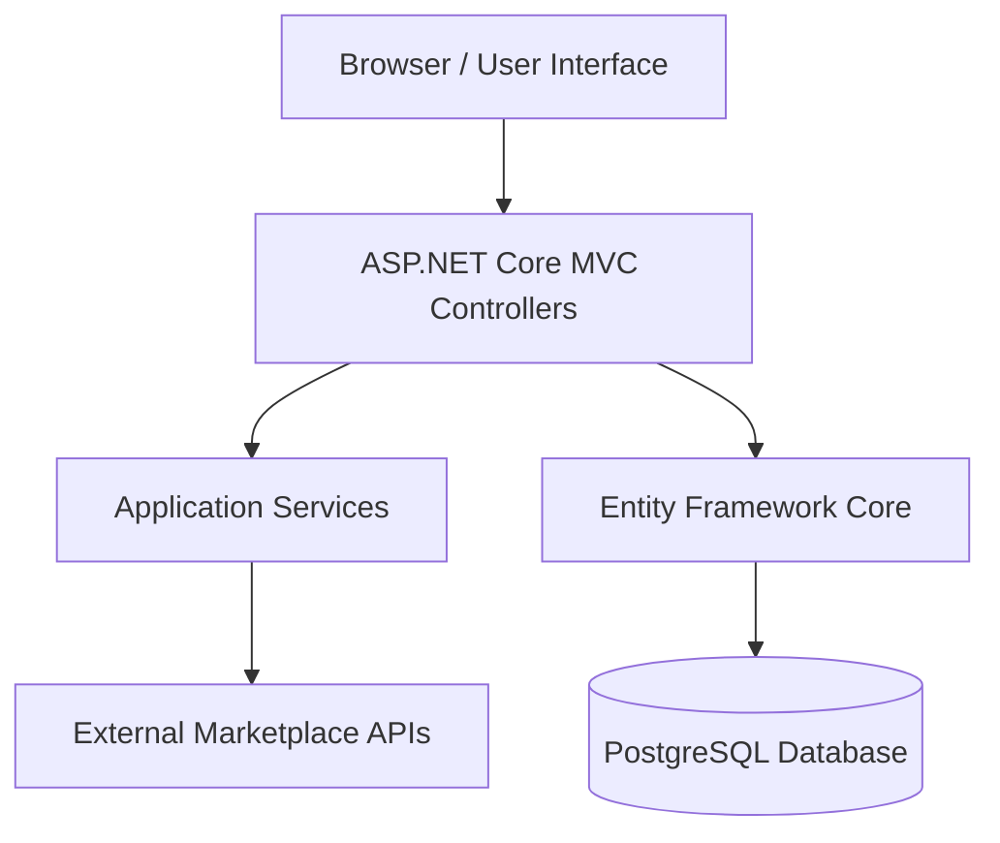
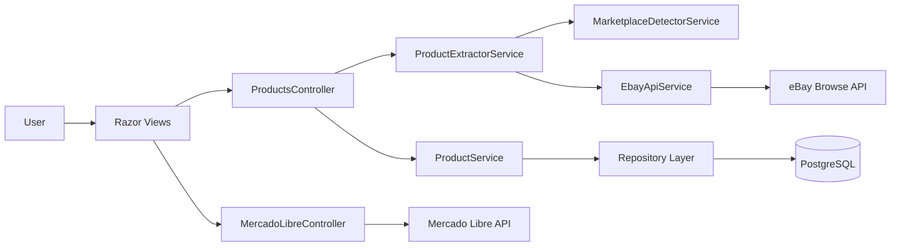
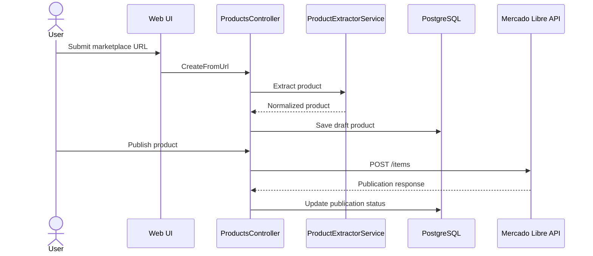

# MarketplaceSync Architecture

# Overview

MarketplaceSync is an ASP.NET Core MVC marketplace synchronization platform designed to import, normalize, manage, review, and publish products into Mercado Libre.

The application follows a layered architecture pattern focused on scalability, maintainability, and external marketplace integrations.

---

# High-Level Architecture


```mermaid
flowchart TD
    A[Browser / User Interface] --> B[ASP.NET Core MVC Controllers]
    B --> C[Application Services]
    C --> D[External Marketplace APIs]
    B --> E[Entity Framework Core]
    E --> F[(PostgreSQL Database)]
```

---

# Enterprise Layer Structure

```text
Presentation Layer
    ↓
Controllers
    ↓
Application Services
    ↓
Repositories
    ↓
Database
```

---

# Presentation Layer

Responsibilities:

- User interaction
- Razor views
- Form handling
- Validation
- Authentication flow
- Product management screens

Technologies:

- ASP.NET Core MVC
- Razor Views
- Bootstrap
- JavaScript

---

# Controllers Layer

Controllers are responsible for:

- Receiving HTTP requests
- Validating models
- Calling services
- Returning responses

Controllers should avoid:

- Business logic
- Direct database queries
- External API orchestration

---

# Services Layer

The services layer centralizes marketplace workflows and business rules.

Main services:

## MarketplaceDetectorService

Responsibilities:

- Detect marketplace source
- Parse marketplace URLs
- Extract marketplace identifiers

Supported marketplaces:

- Amazon
- eBay
- Mercado Libre

---

## ProductExtractorService

Responsibilities:

- Product extraction orchestration
- Marketplace routing
- Product normalization
- Product mapping

---

## EbayApiService

Responsibilities:

- OAuth token retrieval
- Product search
- Product detail retrieval
- Product mapping

---

# Data Access Layer

## AppDbContext

Uses:

- Entity Framework Core
- Npgsql PostgreSQL provider

Main entities:

- Products
- ProductImages
- MercadoLibreTokens
- ImportLogs

---

# Component Diagram


```mermaid
flowchart LR
    User[User] --> UI[Razor Views]

    UI --> ProductsController[ProductsController]
    UI --> MercadoLibreController[MercadoLibreController]

    ProductsController --> ProductExtractorService[ProductExtractorService]
    ProductsController --> ProductService[ProductService]

    ProductExtractorService --> MarketplaceDetectorService[MarketplaceDetectorService]
    ProductExtractorService --> EbayApiService[EbayApiService]

    ProductService --> RepositoryLayer[Repository Layer]

    RepositoryLayer --> PostgreSQL[(PostgreSQL)]

    EbayApiService --> EbayAPI[eBay Browse API]

    MercadoLibreController --> MercadoLibreAPI[Mercado Libre API]
```

---

# Product Synchronization Flow


```mermaid
sequenceDiagram
    actor User

    participant UI as Web UI
    participant Controller as ProductsController
    participant Extractor as ProductExtractorService
    participant DB as PostgreSQL
    participant ML as Mercado Libre API

    User->>UI: Submit marketplace URL

    UI->>Controller: CreateFromUrl

    Controller->>Extractor: Extract product

    Extractor-->>Controller: Normalized product

    Controller->>DB: Save draft product

    User->>Controller: Publish product

    Controller->>ML: POST /items

    ML-->>Controller: Publication response

    Controller->>DB: Update publication status
```

---

# Current Architecture Status

Current maturity level:

- Functional MVP
- Service-oriented extraction flow
- Mercado Libre integration operational
- PostgreSQL persistence operational
- OAuth flow operational

---

# Recommended Enterprise Improvements

## Short-Term

- Move Mercado Libre logic into dedicated services
- Add DTOs and ViewModels separation
- Add repository interfaces
- Add centralized logging
- Add global exception middleware

---

## Medium-Term

- Implement Clean Architecture
- Add background synchronization workers
- Add queue processing
- Add retry policies
- Add automated tests

---

## Long-Term

- Multi-marketplace synchronization
- Distributed workers
- Redis caching
- Event-driven architecture
- Product analytics
- Admin dashboard
