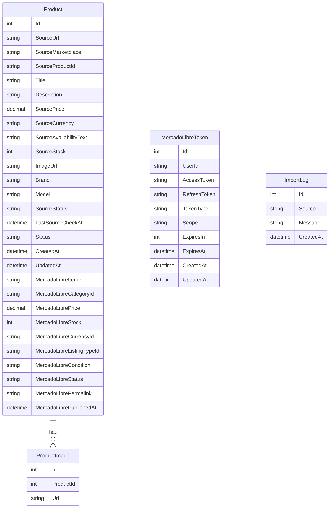

# Database Model

MarketplaceSync uses Entity Framework Core with PostgreSQL.

The main database context is `AppDbContext`.

## Registered DbSets

```csharp
public DbSet<Product> Products => Set<Product>();
public DbSet<ProductImage> ProductImages => Set<ProductImage>();
public DbSet<MercadoLibreToken> MercadoLibreTokens => Set<MercadoLibreToken>();
public DbSet<ImportLog> ImportLogs => Set<ImportLog>();
```

## Entity Relationship Diagram



## Product Entity Purpose

The `Product` entity works as the central bridge between the source marketplace and Mercado Libre.

It stores:

1. Original source data.
2. Internal application status.
3. Mercado Libre publication data.

## Source Marketplace Fields

| Field | Purpose |
|---|---|
| `SourceUrl` | Original product URL. |
| `SourceMarketplace` | Detected marketplace, such as Amazon, eBay, or Mercado Libre. |
| `SourceProductId` | Source product identifier, such as ASIN, eBay Item ID, or MLM ID. |
| `SourcePrice` | Price detected from the source marketplace. |
| `SourceCurrency` | Source price currency. |
| `SourceStock` | Source stock if available. |
| `SourceStatus` | Extraction or source state. |
| `LastSourceCheckAt` | Last time source information was refreshed. |

## Mercado Libre Fields

| Field | Purpose |
|---|---|
| `MercadoLibreItemId` | Mercado Libre publication ID after successful publication. |
| `MercadoLibreCategoryId` | Selected Mercado Libre category. |
| `MercadoLibrePrice` | Final price to publish. |
| `MercadoLibreStock` | Final stock to publish. |
| `MercadoLibreCurrencyId` | Currency, usually `MXN`. |
| `MercadoLibreListingTypeId` | Listing type, currently defaults to `gold_special`. |
| `MercadoLibreCondition` | Product condition, currently defaults to `new`. |
| `MercadoLibreStatus` | Publication status returned by Mercado Libre. |
| `MercadoLibrePermalink` | Public Mercado Libre listing URL. |
| `MercadoLibrePublishedAt` | Publication timestamp. |

## Migration Note

Automatic migrations are currently disabled in `Program.cs` to avoid startup failures in the hosting environment.

Recommended approaches:

### Local development

```bash
dotnet ef database update
```

### Production

Use a controlled deployment step or CI/CD pipeline to apply migrations before starting the web application.
