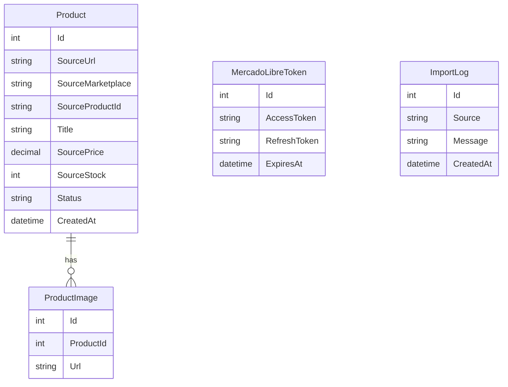

# MarketplaceSync Database Documentation

# Overview

MarketplaceSync uses PostgreSQL with Entity Framework Core.

The database layer manages:

- Product persistence
- Marketplace synchronization data
- Mercado Libre publication tracking
- OAuth credential storage
- Import and synchronization logs

---

# Database Engine

- PostgreSQL
- Entity Framework Core
- Npgsql Provider

---

# Main Database Context

```csharp
public DbSet<Product> Products => Set<Product>();
public DbSet<ProductImage> ProductImages => Set<ProductImage>();
public DbSet<MercadoLibreToken> MercadoLibreTokens => Set<MercadoLibreToken>();
public DbSet<ImportLog> ImportLogs => Set<ImportLog>();
```

---

# Entity Relationship Diagram


```mermaid
erDiagram
    Product {
        int Id
        string SourceUrl
        string SourceMarketplace
        string SourceProductId
        string Title
        decimal SourcePrice
        int SourceStock
        string Status
        datetime CreatedAt
    }

    ProductImage {
        int Id
        int ProductId
        string Url
    }

    MercadoLibreToken {
        int Id
        string AccessToken
        string RefreshToken
        datetime ExpiresAt
    }

    ImportLog {
        int Id
        string Source
        string Message
        datetime CreatedAt
    }

    Product ||--o{ ProductImage : has
```

---

# Products Table

The Product entity is the core business entity.

Responsibilities:

- Store imported products
- Store normalized product information
- Store Mercado Libre publication data
- Track synchronization states

---

# Source Marketplace Fields

| Field | Purpose |
|---|---|
| SourceUrl | Original marketplace URL |
| SourceMarketplace | Marketplace source |
| SourceProductId | Marketplace product ID |
| SourcePrice | Imported source price |
| SourceCurrency | Imported currency |
| SourceStock | Imported stock |
| SourceStatus | Extraction status |

---

# Mercado Libre Fields

| Field | Purpose |
|---|---|
| MercadoLibreItemId | Published item ID |
| MercadoLibreCategoryId | Selected category |
| MercadoLibrePrice | Publication price |
| MercadoLibreStock | Publication stock |
| MercadoLibreCurrencyId | Currency code |
| MercadoLibreListingTypeId | Listing type |
| MercadoLibreCondition | Item condition |
| MercadoLibreStatus | Publication status |
| MercadoLibrePermalink | Public listing URL |

---

# ProductImages Table

Stores product image relationships.

Responsibilities:

- Multiple images per product
- Marketplace image persistence
- Future image synchronization

---

# MercadoLibreTokens Table

Stores Mercado Libre OAuth information.

Responsibilities:

- OAuth access token persistence
- Refresh token storage
- Expiration management

Security recommendation:

- Encrypt sensitive credentials
- Never expose tokens in logs

---

# ImportLogs Table

Stores synchronization and extraction events.

Responsibilities:

- Import diagnostics
- Synchronization auditing
- Error tracking
- Operational visibility

---

# Recommended Future Tables

Recommended enterprise entities:

- Users
- Roles
- Permissions
- SyncJobs
- ProductAttributes
- ProductVariants
- MarketplaceAccounts
- PublicationHistory
- ErrorLogs
- AuditLogs

---

# Database Recommendations

## Performance

Recommended:

- Add indexes for searches
- Optimize publication queries
- Use pagination
- Add query caching

---

## Security

Recommended:

- Encrypt OAuth credentials
- Secure environment variables
- Limit database permissions
- Add audit logging

---

## Scalability

Recommended:

- Queue-based synchronization
- Partition large log tables
- Add Redis caching
- Add asynchronous workers

---

# Migration Strategy

Automatic migrations are currently disabled to avoid startup failures.

Recommended deployment flow:

## Development

```bash
dotnet ef database update
```

## Production

Use controlled CI/CD migration execution before application startup.
