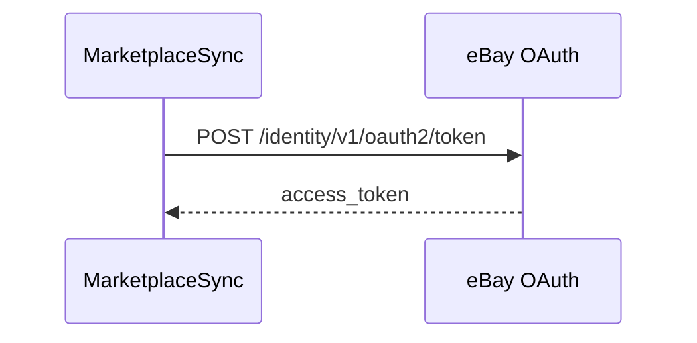
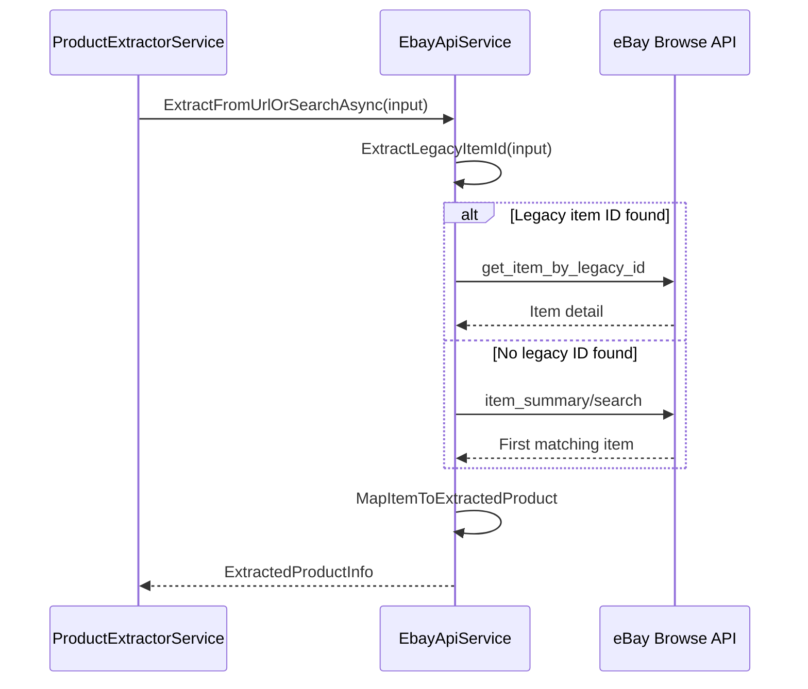

# eBay Integration

MarketplaceSync currently has its most complete source extraction integration with eBay.

The main service is:

```text
Services/EbayApiService.cs
```

## Purpose

`EbayApiService` is responsible for:

- Getting an eBay application access token.
- Extracting a legacy eBay item ID from a URL.
- Retrieving item details by legacy item ID.
- Searching the first matching product when no item ID is available.
- Mapping eBay API response data into internal `ExtractedProductInfo`.

## Required Configuration

```json
{
  "Ebay": {
    "ClientId": "your_ebay_client_id",
    "ClientSecret": "your_ebay_client_secret",
    "MarketplaceId": "EBAY_US"
  }
}
```

## Token Flow



The service uses the client credentials flow with:

```text
grant_type=client_credentials
scope=https://api.ebay.com/oauth/api_scope
```

## Extraction Flow



## eBay API Endpoints Used

| Endpoint | Purpose |
|---|---|
| `https://api.ebay.com/identity/v1/oauth2/token` | Gets application token. |
| `https://api.ebay.com/buy/browse/v1/item/get_item_by_legacy_id` | Gets item detail by legacy item ID. |
| `https://api.ebay.com/buy/browse/v1/item_summary/search` | Searches products by keyword. |

## Extracted Fields

The current mapping attempts to extract:

| Field | Description |
|---|---|
| `Title` | eBay product title. |
| `SourceUrl` | eBay product URL. |
| `SourceProductId` | eBay item ID. |
| `ImageUrl` | Main product image. |
| `SourcePrice` | Product price. |
| `SourceCurrency` | Product currency. |
| `Condition` | eBay item condition. |
| `SourceStatus` | Extraction status. |
| `Description` | Internal extraction note. |

## Current Behavior

If a valid eBay item ID is found in the URL, the app uses item detail lookup.

If no item ID is found, the app cleans the input and uses it as a search keyword.

If eBay returns an error, the application still creates an `ExtractedProductInfo` object with an error status, allowing the user to review the product manually.

## Recommended Improvements

- Cache eBay application token until expiration.
- Add stronger error handling and logging.
- Add support for item availability and shipping data.
- Add support for multiple search results instead of only the first result.
- Add a manual selection screen when several eBay matches are found.
- Normalize currency conversion before preparing the Mercado Libre price.
