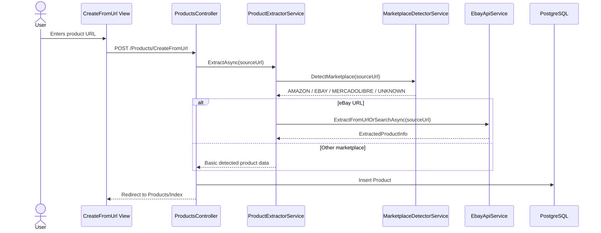
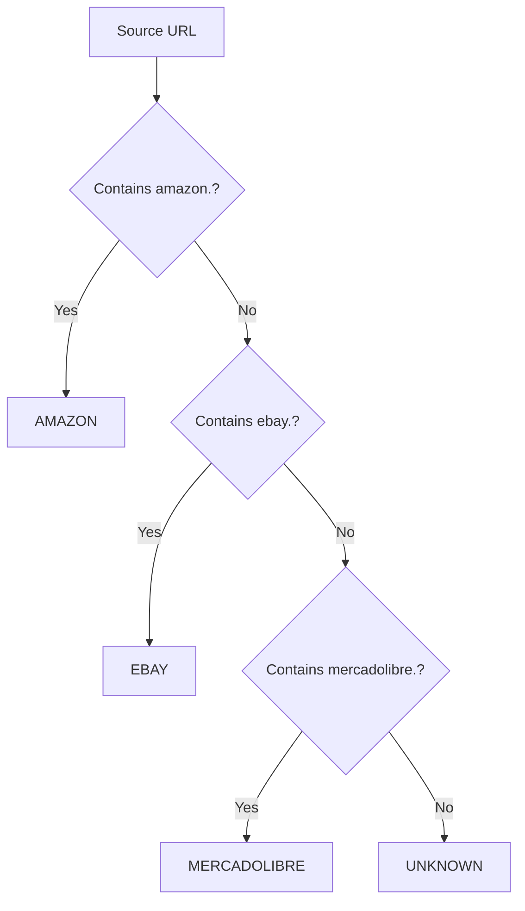
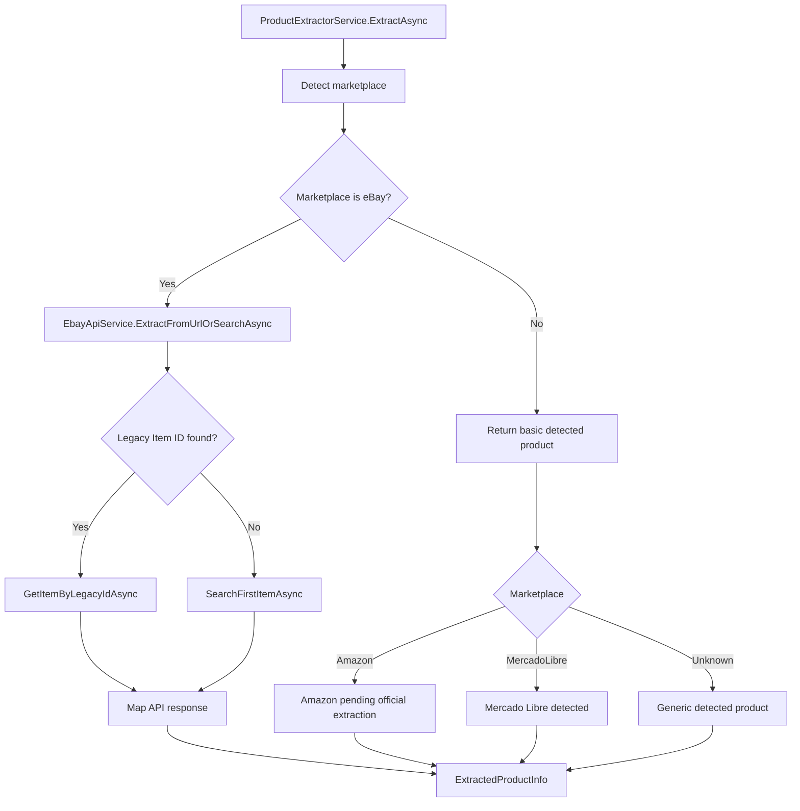
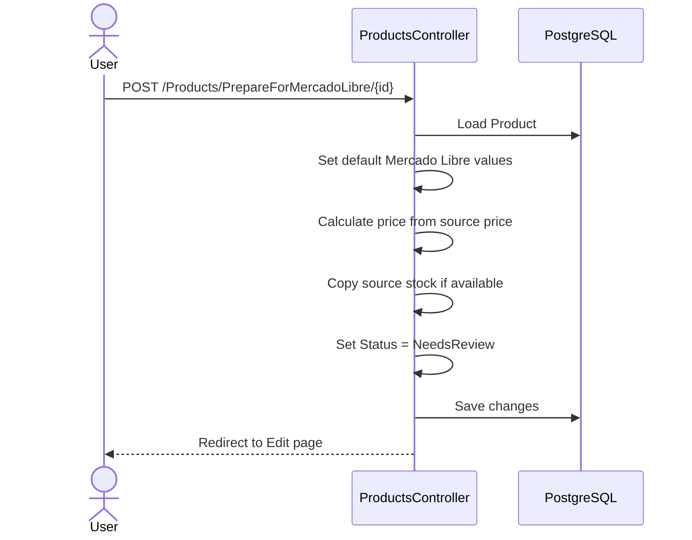
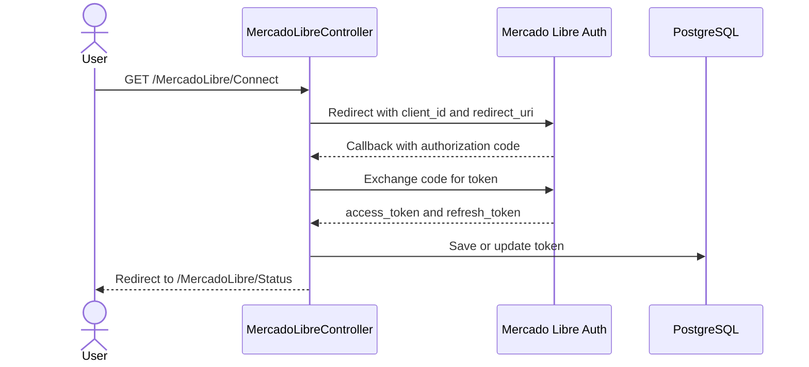
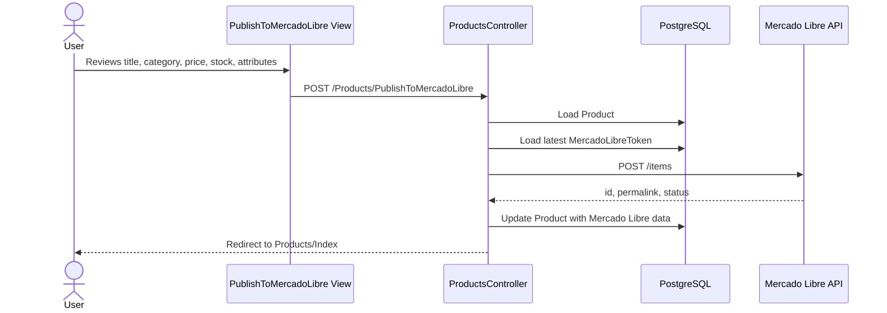
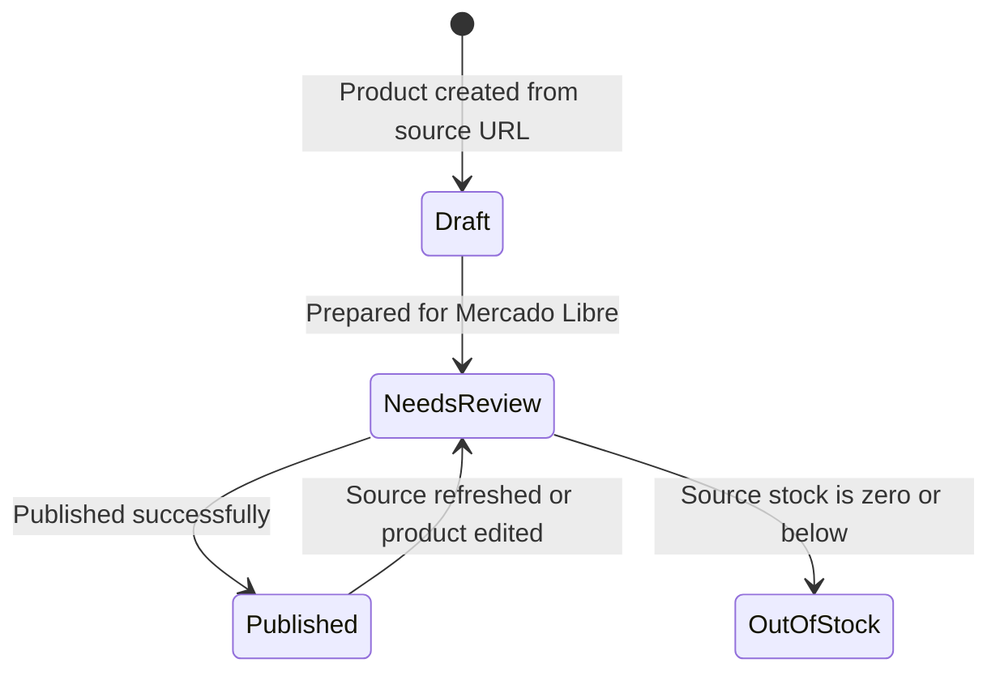

# Application Flows

This document describes the main functional flows of MarketplaceSync.

## 1. Create Product From URL

## 2. Marketplace Detection Flow

## 3. Product Extraction Flow

## 4. Prepare Product for Mercado Libre

## 5. Mercado Libre OAuth Flow

## 6. Publish Product to Mercado Libre

## 7. Product State Flow

## Current Product States

| State | Description |
|---|---|
| `Draft` | Product was created from a source URL but has not been prepared for Mercado Libre. |
| `NeedsReview` | Product has Mercado Libre values and should be reviewed before publication. |
| `Published` | Product was published to Mercado Libre. |
| `OutOfStock` | Product source stock is zero or unavailable. |
