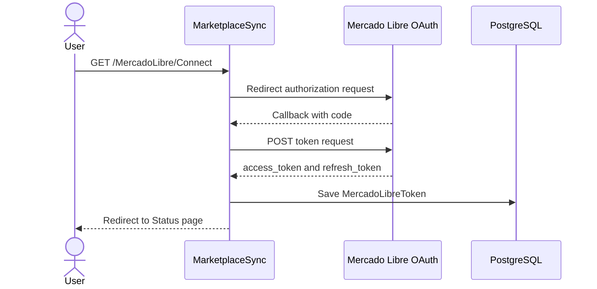
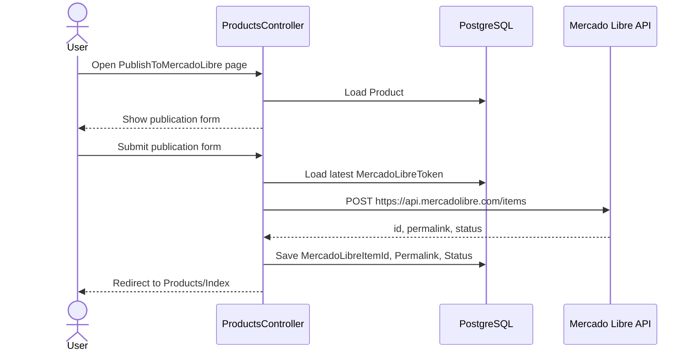

# Mercado Libre Integration

MarketplaceSync integrates with Mercado Libre for account connection, category support, attribute loading, user validation, and product publication.

## Main Controller

Mercado Libre functionality is currently handled mainly by:

- `MercadoLibreController`
- `ProductsController`

## OAuth Connection Flow



## Required Configuration

```json
{
  "MercadoLibre": {
    "ClientId": "your_client_id",
    "ClientSecret": "your_client_secret",
    "RedirectUri": "https://your-domain.com/MercadoLibre/Callback",
    "AuthUrl": "https://auth.mercadolibre.com.mx/authorization",
    "TokenUrl": "https://api.mercadolibre.com/oauth/token"
  }
}
```

## Important Endpoints

| Endpoint | Purpose |
|---|---|
| `/MercadoLibre/Status` | Shows latest stored Mercado Libre token status. |
| `/MercadoLibre/Connect` | Starts Mercado Libre OAuth authorization flow. |
| `/MercadoLibre/Callback` | Receives authorization code and exchanges it for tokens. |
| `/MercadoLibre/Me` | Calls `/users/me` to validate the current access token. |
| `/MercadoLibre/CategoryPredictor?title=...` | Uses Mercado Libre domain discovery by title. |
| `/MercadoLibre/CategoryAttributes?categoryId=...` | Loads category attributes from Mercado Libre. |
| `/MercadoLibre/Notifications` | Placeholder endpoint for Mercado Libre notifications. |

## Product Publication Flow



## Publication Payload

The current publication payload includes:

- `title`
- `category_id`
- `price`
- `currency_id`
- `available_quantity`
- `buying_mode`
- `listing_type_id`
- `condition`
- `pictures`
- `attributes`

## Current Limitations

1. Token refresh is not yet automated.
2. Mercado Libre API logic is partially inside controllers.
3. Attribute validation depends on user input.
4. Notifications endpoint exists but does not process notification payloads yet.
5. Error handling returns raw API content in some cases.

## Recommended Improvements

Create dedicated services:

```text
Services/MercadoLibreAuthService.cs
Services/MercadoLibreCatalogService.cs
Services/MercadoLibrePublishingService.cs
Services/MercadoLibreNotificationService.cs
```

Recommended responsibilities:

- `MercadoLibreAuthService`
  - Get valid token.
  - Refresh token when expired.
  - Store updated tokens.

- `MercadoLibreCatalogService`
  - Category prediction.
  - Attribute loading.
  - Category metadata.

- `MercadoLibrePublishingService`
  - Build publication payload.
  - Publish item.
  - Update product publication data.

- `MercadoLibreNotificationService`
  - Receive notifications.
  - Validate notification source.
  - Update local product state.
