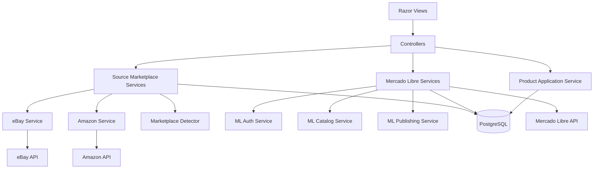

# Recommended Improvements

This document lists recommended technical improvements for MarketplaceSync based on the current implementation.

## 1. Add Mercado Libre Token Refresh

The application stores Mercado Libre access and refresh tokens, but token refresh should be automated before calling protected Mercado Libre endpoints.

Recommended service:

```text
Services/MercadoLibreAuthService.cs
```

Suggested methods:

```csharp
Task<string> GetValidAccessTokenAsync();
Task RefreshTokenAsync(MercadoLibreToken token);
```

## 2. Move Mercado Libre Business Logic Out of Controllers

`ProductsController` currently handles publication logic directly.

Recommended services:

```text
Services/MercadoLibrePublishingService.cs
Services/MercadoLibreCatalogService.cs
```

Benefits:

- Cleaner controllers.
- Easier testing.
- Better separation of responsibilities.
- Easier future support for update, pause, delete, or sync operations.

## 3. Add Internal Authentication

The application should have authentication before being used in production.

Recommended options:

- ASP.NET Core Identity.
- Simple admin login.
- OAuth login provider.
- Restrict access by environment or reverse proxy authentication.

Minimum protection should be added for:

- Product creation.
- Product editing.
- Mercado Libre connection.
- Mercado Libre publication.
- Token status pages.

## 4. Add Background Synchronization

A future version should synchronize source marketplace data automatically.

Recommended background tasks:

- Refresh source product price.
- Refresh source stock.
- Detect source product status changes.
- Mark product as `NeedsReview` when source data changes.
- Mark product as `OutOfStock` when source stock is zero.

Recommended technologies:

- Hangfire.
- Quartz.NET.
- ASP.NET Core BackgroundService.
- External scheduled job from the hosting platform.

## 5. Improve Amazon Support

Amazon currently has basic detection but not full product extraction.

Recommended approach:

- Use an official Amazon API or approved data provider.
- Avoid scraping if it violates platform terms.
- Store ASIN, price, image, title, brand, model, and availability.

Recommended service:

```text
Services/AmazonProductService.cs
```

## 6. Improve Product Review Workflow

Before publication, the product review page should validate:

- Title length.
- Required category.
- Required attributes.
- Valid price.
- Valid stock.
- At least one image.
- Allowed condition.
- Currency compatibility.

## 7. Add Better Error Handling

Some API errors are currently returned as raw content.

Recommended improvements:

- Use structured error view models.
- Log API request failures.
- Display user-friendly messages.
- Store failed publication attempts in `ImportLogs` or a dedicated log table.

## 8. Add Deployment Documentation

Create a deployment guide for the selected hosting platform.

Recommended file:

```text
docs/deployment.md
```

Suggested sections:

- Environment variables.
- PostgreSQL connection string.
- Mercado Libre redirect URI.
- eBay credentials.
- EF Core migration strategy.
- Render or hosting startup command.

## 9. Suggested Future Architecture



## 10. Suggested Development Roadmap

### Phase 1 — Stabilize MVP

- Add authentication.
- Add token refresh.
- Improve Mercado Libre publication errors.
- Add deployment guide.

### Phase 2 — Improve Product Sync

- Add background source refresh.
- Add price and stock comparison.
- Add product change history.
- Add review alerts.

### Phase 3 — Expand Marketplace Support

- Add full Amazon extraction.
- Improve eBay availability handling.
- Add manual source matching.
- Add bulk import.

### Phase 4 — Operational Features

- Dashboard metrics.
- Publication status report.
- Failed sync log.
- Product profitability calculation.
- Currency exchange configuration.
